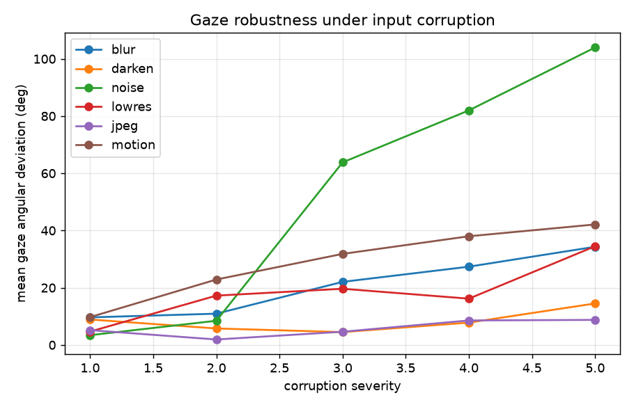
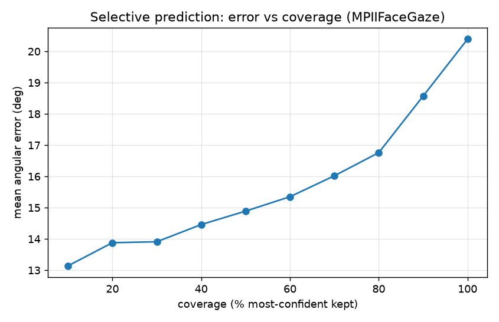
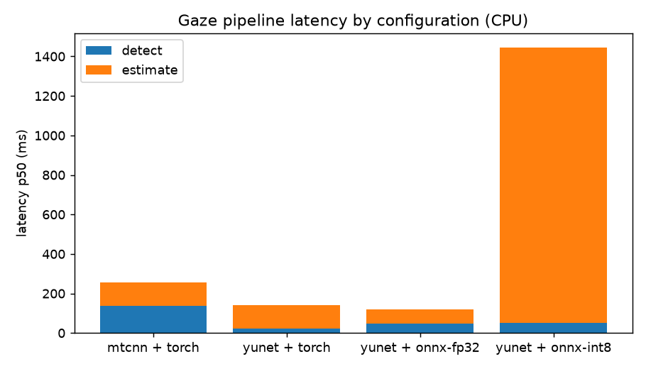
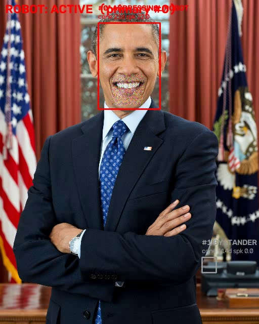
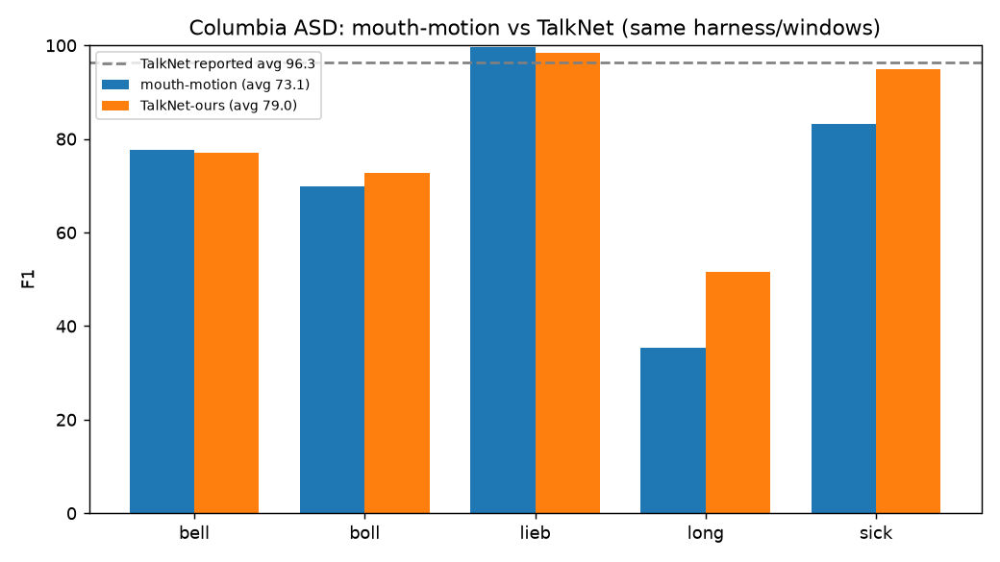

# Gaze360 / L2CS-Net — Live Gaze Estimation Demo

Real-time appearance-based **gaze estimation** from a webcam, video, or image.
Faces are detected with MTCNN, and gaze (yaw/pitch) is predicted with
**L2CS-Net** (ResNet-50 backbone, 90-bin soft-argmax heads), trained on the
**Gaze360** dataset. Each detected face gets a projected 3D gaze arrow.

Runs on **CPU** (no GPU required).

## Why L2CS-Net (and not the original Gaze360 LSTM)

The plan started from the Gaze360 paper (Kellnhofer et al., ICCV 2019), whose
model is a ResNet-18 + bidirectional LSTM over a 7-frame window. Its official
pretrained weights are hosted at `gaze360.csail.mit.edu`, which is currently
returning HTTP 403 for all files. **L2CS-Net** (Abdelrahman et al., 2022) is a
single-frame model trained on the same Gaze360 dataset — its weights are
mirrored on Hugging Face, it needs no temporal buffer, and it is the stronger
real-time / on-robot choice. This repo uses L2CS-Net; swapping in the Gaze360
LSTM later only requires a new `model.py` + weights.

## Setup

Uses [`uv`](https://docs.astral.sh/uv/) with Python 3.12.

```bash
uv venv --python 3.12
uv pip install -r requirements.txt
```

## Weights

The L2CS-Net (Gaze360, ResNet-50) checkpoint (~96 MB):

```bash
curl -L -o gaze360_model.pth.tar \
  "https://huggingface.co/smoky1496/gaze360/resolve/main/gaze360.pkl?download=true"
```

## Run

```bash
# webcam (opens a window, press q to quit)
python gaze.py --source 0

# a video file -> annotated .mp4
python gaze.py --source clip.mp4 --output out.mp4

# a single image -> annotated .jpg
python gaze.py --source face.jpg --output out.jpg
```

Useful flags: `--input-size` (L2CS crop size, default 224), `--det-size`
(MTCNN size), `--device cuda` (if a GPU is available).

## Robustness

The pipeline is hardened for real-world input:

- **Detection resilience** — MTCNN confidence threshold (`--min-prob`) and
  minimum face size (`--min-size`); no-face and NaN-angle frames are handled
  gracefully.
- **Temporal smoothing** — per-face [One-Euro filter](https://gery.casiez.net/1euro/)
  on yaw/pitch, keyed by an IoU tracker so each person is smoothed
  independently. Cuts jitter ~60% (see eval).
- **Confidence gating** — softmax **entropy** of the yaw/pitch heads gives a
  per-face confidence in [0,1]; low-confidence gaze is flagged and grayed out
  instead of drawn as a confident (wrong) arrow.
- **Low-light correction** — automatic CLAHE on the L channel when a frame is
  dark, before detection.

Toggle with `--no-smooth`, `--no-lowlight`, `--conf-thresh`, `--min-prob`,
`--min-size`. Add `--log run.jsonl` for a structured per-frame record
(boxes, angles, confidence, stage timings).

## Evaluation

`eval_robustness.py` runs three **label-free** evals (no ground-truth dataset
required) and writes `eval_out/robustness.json` + a degradation plot:

```bash
python eval_robustness.py                 # uses test_face.jpg
python eval_robustness.py --images data   # a folder of face images
```

1. **Corruption sweep** — degrade inputs at 5 severities (blur, darken, noise,
   low-res, JPEG, motion blur) and measure gaze **angular deviation** from the
   clean prediction, plus detection rate and confidence.
2. **Temporal stability** — synthesize a static-gaze clip and measure per-frame
   angular jitter with smoothing **OFF vs ON**.
3. **Latency** — p50/p95 detect/estimate/total ms and FPS.

Representative CPU results (1 face, inputs capped at 640 px):

| corruption | s1 | s2 | s3 | s4 | s5 |
|---|---|---|---|---|---|
| blur   |  9.6 | 10.9 | 22.1 | 27.4 | 34.3 |
| darken |  8.9 |  5.8 |  4.5 |  7.8 | 14.5 |
| noise  |  3.4 |  8.5 | 63.8 | 82.0 | 104.0 |
| lowres |  4.7 | 17.2 | 19.6 | 16.2 | 34.5 |
| jpeg   |  5.2 |  1.9 |  4.6 |  8.6 |  8.8 |
| motion |  9.7 | 22.9 | 31.8 | 38.0 | 42.1 |

*(mean gaze angular deviation, degrees — lower is more robust)*



- **Temporal smoothing:** yaw jitter 1.91° → 0.72° (**−62%**).
- **Latency:** ~199 ms/frame total (p50), ~5 FPS on CPU — MTCNN detection
  dominates; a lighter detector or GPU raises this substantially.

Takeaway: gaze is most fragile to **sensor noise** (add denoising upstream) and
robust to **JPEG/darkening**; smoothing markedly steadies the live output.

## Cross-dataset accuracy (MPIIFaceGaze)

This checkpoint is **Gaze360-trained**, so evaluating on MPIIFaceGaze measures
**cross-dataset generalization**. Ground-truth gaze is the camera-frame vector
`gaze_target − face_center` from each subject's annotations; our model predicts
in the same frame, so no head-pose normalization is needed. Run:

```bash
python export_onnx.py                                  # (for the fast backend)
python eval_mpii.py --data data/MPIIFaceGaze --per-subject 50
python eval_mpii.py --data data/MPIIFaceGaze --per-subject 50 --tta
```

| config | mean angular error | median |
|---|---|---|
| baseline | **20.39°** | 17.71° |
| + test-time aug (hflip) | **18.01°** (−11.7%) | — |

*(746 samples across 15 subjects; ~20° is the expected range for Gaze360→MPII
cross-dataset transfer.)*

## Uncertainty-aware gaze (novel result)

The softmax **entropy** of the yaw/pitch heads is a **calibrated uncertainty
signal**: it predicts when the model is wrong, with no extra training.

- **Correlation(confidence, angular error) = −0.54** (Pearson) — higher
  confidence ⇒ lower error.
- **Selective prediction** — discarding the least-confident predictions
  monotonically lowers error:

| coverage (most-confident kept) | 100% | 80% | 50% | 10% |
|---|---|---|---|---|
| mean angular error | 20.4° | 16.8° | 14.9° | 13.1° |

Keeping the top 50% cuts cross-dataset error **27%** — useful on a robot, where
a low-confidence gaze estimate can be dropped rather than acted on.



## Latency (CPU) and deployment

`bench_latency.py` compares detector × backend combinations (p50, capped at
640 px):

| config | detect | estimate | total p50 | FPS | speedup |
|---|---|---|---|---|---|
| MTCNN + PyTorch (baseline) | 136 ms | 121 ms | 259 ms | 3.9 | 1.0× |
| YuNet + PyTorch | 22 ms | 118 ms | 140 ms | 7.2 | 1.9× |
| **YuNet + ONNX-fp32** | 47 ms | **72 ms** | **116 ms** | **8.6** | **2.2×** |
| YuNet + ONNX-INT8 | 53 ms | 1391 ms | 1465 ms | 0.7 | 0.2× |

Takeaways: swapping MTCNN → **YuNet** cuts detection ~6×; **ONNX Runtime fp32**
further speeds the ResNet-50 estimator (graph optimizations). **Dynamic INT8
quantization *hurts* here** — it targets MatMul/LSTM, not convolutions, so it
regresses a CNN badly; static (calibration-based) quantization would be the
correct tool. ONNX export is also the natural handoff to edge runtimes (Jetson).



Enable the fast path in the demo: `--detector yunet --backend onnx`.

## Addressee awareness — who is talking *to the robot*? (Stage 1)

Gaze answers "who is looking at the robot"; it does **not** answer "who is
talking *to* it." This stage fuses gaze with **active-speaker detection** into
an **interpretable** per-person addressee state and a robot conversational
role — every decision traces to named, logged signals (no black box):

```
Gaze360  -> gaze cone angle to camera + confidence   (attention)
ASD      -> mouth-region motion energy               (is this person speaking)
fusion   -> addressee state + robot role
```

Per-person state and robot role:

| signal | meaning |
|---|---|
| `BYSTANDER` | not attending the robot |
| `ATTENTIVE` | looking at the robot, not speaking |
| `ADDRESSING_ROBOT` | attentive **and** speaking (debounced) |
| robot `PASSIVE` / `ACTIVE` | no one / someone is addressing the robot |

Debouncing (engagement, speaking, and ACTIVE-release) suppresses transient
flicker. Run on a clip or webcam:

```bash
python make_test_convo.py                              # build a test clip
python converse.py --source test_convo.mp4 --output out.mp4 --log run.jsonl
python converse.py --source 0                          # webcam
```

Validated on a scripted clip (quiet → speaking → quiet) built from a real
face: the state machine holds `ATTENTIVE/PASSIVE` while quiet and switches to
`ADDRESSING_ROBOT/ACTIVE` exactly over the speaking segment. A spurious
background detection is correctly held as `BYSTANDER` — graceful multi-party
degradation.



### Stage 1 evaluation

Two self-contained quantitative evals (`eval_asd.py`, `eval_fusion.py`):

**Active-speaker detector** (mouth motion), 75 in-memory frames with known
speaking segments (no codec noise):

| accuracy | precision | recall | F1 |
|---|---|---|---|
| 0.79 | 0.68 | **0.87** | **0.77** |

High recall, lower precision (rolling-window tail) — a fair score for the
heuristic that quantifies the headroom a TalkNet swap would fill.

**Addressee fusion / state machine**, 7 controlled multi-party scenarios:

- **per-person state accuracy 9/9 (100%)**, **robot-role accuracy 6/6 (100%)**
- background off-axis speaker → correctly `BYSTANDER` (no false ACTIVE trigger)
- low-confidence gaze → gated to `BYSTANDER`
- temporal engage → release verified (`ACTIVE` → `PASSIVE`)
- the "looking-but-addressing-others" case is reported as a **known gap**
  (fires `ADDRESSING_ROBOT`; needs Stage 2/3)

### Recognized ASD benchmark — Columbia

`eval_columbia.py` runs both ASD backends through the standard **Columbia ASD**
protocol (Chakravarty & Zisserman 2016): per labeled frame, match each speaker's
GT face box to a detected face, take that face's speaking score, report
per-speaker F1 over {bell, boll, lieb, long, sick}. Same detection, tracking,
windows, and matching for both — so the comparison isolates the **ASD method**.
Evaluated on dense mixed-class windows (a subset of the 87-min video) to bound
CPU cost.

```bash
python eval_columbia.py --asd mouth
python eval_columbia.py --asd talknet   # needs talknet weights + col_audio.wav
```

| method | bell | boll | lieb | long | sick | **avg** |
|---|---|---|---|---|---|---|
| mouth-motion (heuristic) | 77.6 | 69.8 | 99.7 | 35.4 | 83.2 | **73.1** |
| **TalkNet** (audio-visual) | 77.1 | 72.8 | 98.5 | 51.6 | 95.0 | **79.0** |
| TalkNet (reported, full pipeline) | — | — | — | — | — | 96.3 |



Swapping the mouth-motion heuristic for **TalkNet** lifts avg F1 **+5.9**, with
the gains exactly where the heuristic was weak — `long` (35→52) and `sick`
(83→95) — while the already-easy `bell`/`lieb` are unchanged. This validates
audio-visual ASD as the upgrade path.

**Why our TalkNet (79.0) < reported (96.3):** this is a drop-in integration
using our lightweight preprocessing (YuNet crops, native 29.97 fps with a 4:1
audio ratio, single-duration scoring) rather than TalkNet's full pipeline
(S3FD + scene detection, 25 fps resample, multi-duration averaging). The
residual gap is **preprocessing, not the model** — a concrete pointer to where
further integration effort pays off.

*Not yet done:* closing the preprocessing gap; real multi-party **addressee**
precision/recall (Vernissage/AMI) — needs a labeled multi-party dataset.

**Model-free ASD** (mouth motion) is a deliberate Stage-1 proxy for
audio-visual ASD (TalkNet). **Known limitation:** `ADDRESSING_ROBOT` currently =
attentive + speaking, so someone who looks at the robot while talking to *other
people* can misfire. Disambiguating that — plus **backchannel vs interruption**
turn-taking — needs multi-party mutual-gaze and a turn-taking model (**VAP**,
Ekstedt & Skantze 2022). Planned next:

- **Stage 2** — add VAP: distinguish backchannels ("mhm", keep talking) from
  genuine interruptions (yield, then resume-or-abandon the prior plan).
- **Stage 3** — multi-party robustness + the "looking-but-addressing-others"
  case, with addressee precision/recall on labeled multi-party video.

## How it works

1. **Detect** — MTCNN returns face boxes (`keep_all=True`).
2. **Preprocess** — crop each face, resize to 224², ImageNet-normalize.
3. **Estimate** — L2CS-Net outputs 90-bin logits for yaw and pitch; a softmax
   expectation over bin centers (4° each, spanning ±180°) gives continuous
   angles.
4. **Render** — convert (yaw, pitch) to a gaze direction and draw the arrow,
   face box, and per-face angle label; overlay FPS on streams.

## Files

- `l2cs_model.py` — L2CS-Net (ResNet-50 + yaw/pitch heads) + strict loader.
- `gaze_utils.py` — gaze math, entropy confidence, low-light correction.
- `filters.py` — One-Euro temporal filter.
- `tracking.py` — IoU tracker for stable per-face IDs.
- `detectors.py` — pluggable MTCNN / YuNet face detectors.
- `gaze.py` — detection → estimation → tracking/smoothing → rendering + CLI.
- `eval_robustness.py` — label-free robustness/latency eval harness.
- `eval_mpii.py` — MPIIFaceGaze cross-dataset accuracy + uncertainty analysis.
- `export_onnx.py` — export L2CS to ONNX (+INT8) with parity check.
- `bench_latency.py` — detector × backend latency benchmark.
- `asd.py` — lightweight visual active-speaker detection (mouth motion).
- `addressee.py` — interpretable gaze × speaking fusion + robot state machine.
- `converse.py` — addressee-aware runner (video/webcam) + JSONL logging.
- `make_test_convo.py` — builds the scripted validation clip.
- `eval_asd.py` — quantitative active-speaker-detector eval (P/R/F1).
- `eval_fusion.py` — controlled multi-party addressee state-machine eval.
- `eval_columbia.py` — Columbia ASD benchmark (per-speaker F1), `--asd mouth|talknet`.
- `talknet_asd.py` + `talknet/` — vendored TalkNet audio-visual ASD (inference).

## Credits & license

- **Gaze360** — Kellnhofer et al., *Gaze360: Physically Unconstrained Gaze
  Estimation in the Wild*, ICCV 2019.
- **L2CS-Net** — Abdelrahman et al., *L2CS-Net: Fine-Grained Gaze Estimation in
  Unconstrained Environments*, 2022.
- Face detection via [facenet-pytorch](https://github.com/timesler/facenet-pytorch) MTCNN.

Model weights are for **non-commercial research use** per the upstream Gaze360
license. This demo code is provided for research/educational use.
